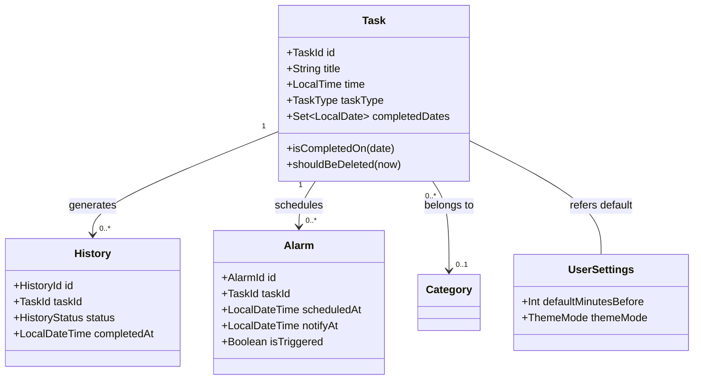
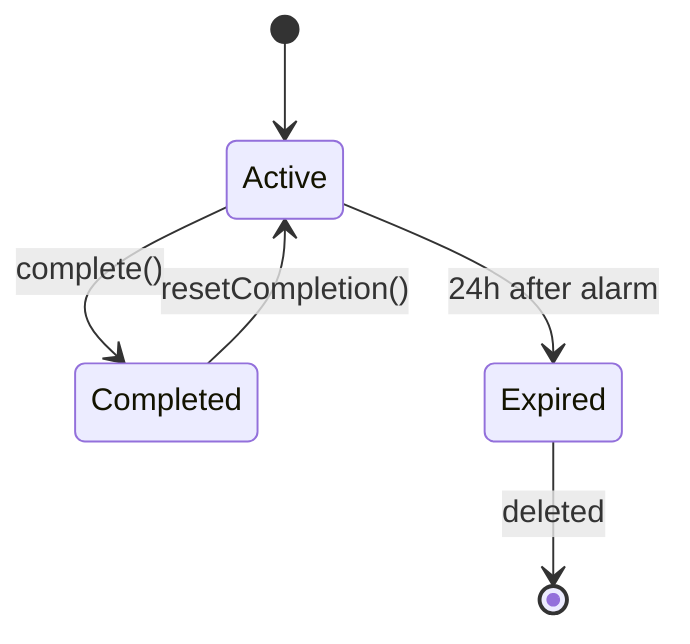
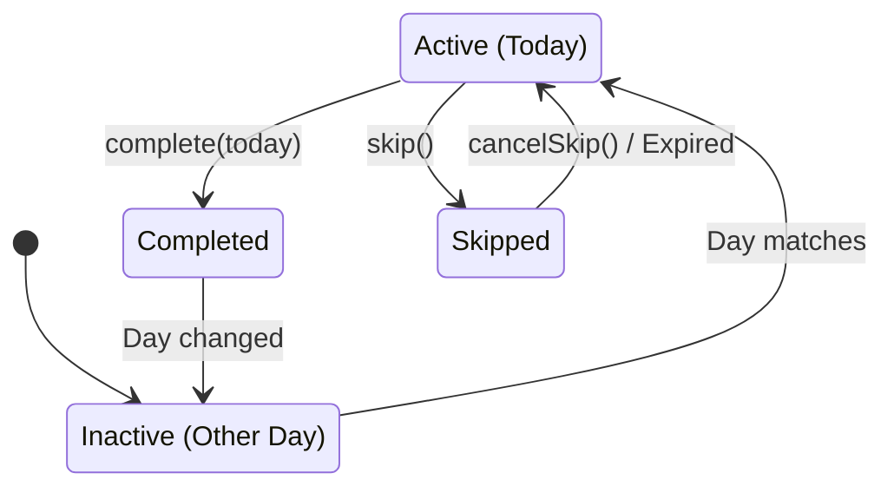

# ドメインモデル定義

yatteプロジェクトのコアドメインモデルの詳細定義。

## 概念モデル図

---

## 1. Task 集約

タスク管理の中核となる集約。

### Task

| プロパティ | 型 | 必須 | 説明 | 制約 |
|------------|----|------|------|------|
| `id` | `TaskId` | ✅ | 一意識別子 | UUID |
| `title` | `String` | ✅ | タスク名 | 1〜100文字 |
| `time` | `LocalTime` | ✅ | アラーム基準時刻 | - |
| `minutesBefore` | `Int` | ✅ | アラーム前通知時間 | 0〜60分 |
| `taskType` | `TaskType` | ✅ | タスク種類 | - |
| `weekDays` | `List<DayOfWeek>` | - | 繰り返す曜日 | `WEEKLY_LOOP`時 1つ以上 |
| `completedDates` | `Set<LocalDate>` | ✅ | 完了済みの日付セット | - |
| `createdAt` | `LocalDateTime` | ✅ | 作成日時 | - |
| `alarmTriggeredAt` | `LocalDateTime?` | - | アラーム発火日時 | ONE_TIMEタスクの削除判定用 |
| `skipUntil` | `LocalDate?` | - | スキップ期限日 | WEEKLY_LOOPのみ有効 |
| `categoryId` | `CategoryId?` | - | カテゴリID | 任意 |

### 状態遷移（ONE_TIME）

### 状態遷移（WEEKLY_LOOP）

---

## 2. History 集約

完了したタスクの記録。不変（Immutable）なイベントログとして扱う。

### History

| プロパティ | 型 | 説明 |
|------------|----|------|
| `id` | `HistoryId` | 履歴ID |
| `taskId` | `TaskId` | 元タスクの参照 |
| `title` | `String` | 完了時点のタスク名（スナップショット） |
| `completedAt` | `LocalDateTime` | 完了日時 |
| `status` | `HistoryStatus` | 完了理由 |

### HistoryStatus

- `COMPLETED`: 通常完了
- `SKIPPED`: スキップ
- `EXPIRED`: 期限切れ（自動削除）

---

## 3. Alarm 集約

OSのアラーム機能との橋渡しを行うモデル。

### Alarm

| プロパティ | 型 | 説明 |
|------------|----|------|
| `id` | `AlarmId` | アラームID |
| `taskId` | `TaskId` | タスクID |
| `scheduledAt` | `LocalDateTime` | アラーム予定日時 |
| `notifyAt` | `LocalDateTime` | 実際に通知する日時 (`scheduledAt - minutesBefore`) |
| `isTriggered` | `Boolean` | 発火済みフラグ |

---

## 4. Settings 集約

ユーザー設定。

### UserSettings

| プロパティ | 型 | デフォルト |
|------------|----|------------|
| `defaultMinutesBefore` | `Int` | 10 |
| `notificationSound` | `Boolean` | true |
| `notificationVibration` | `Boolean` | true |
| `customSoundUri` | `String?` | null |
| `themeMode` | `ThemeMode` | SYSTEM |

---

## 5. Category 集約

タスクの分類。

### Category

| プロパティ | 型 | 必須 | 説明 |
|------------|----|------|------|
| `id` | `CategoryId` | ✅ | カテゴリID |
| `name` | `String` | ✅ | カテゴリ名 |
| `color` | `CategoryColor` | ✅ | 表示色 |
| `createdAt` | `Long` | ✅ | 作成日時 (EpochMillis) |

### CategoryColor

Androidの `Color` 定義に対応するEnum。
`RED`, `PINK`, `PURPLE`, ... `BLUE_GREY` まで定義。

---

## バリデーションルール一覧

1. **タスクタイトル**: 空白不可、最大100文字
2. **通知時間**: 0分以上、60分以下
3. **週次設定**: `WEEKLY_LOOP` の場合、`weekDays` は空であってはならない
4. **アラーム**: `notifyAt` は `scheduledAt` より前または同時刻でなければならない
5. **スキップ**: `skipUntil` は未来の日付でなければならない（推奨）

---

*作成日: 2025-12-27*
